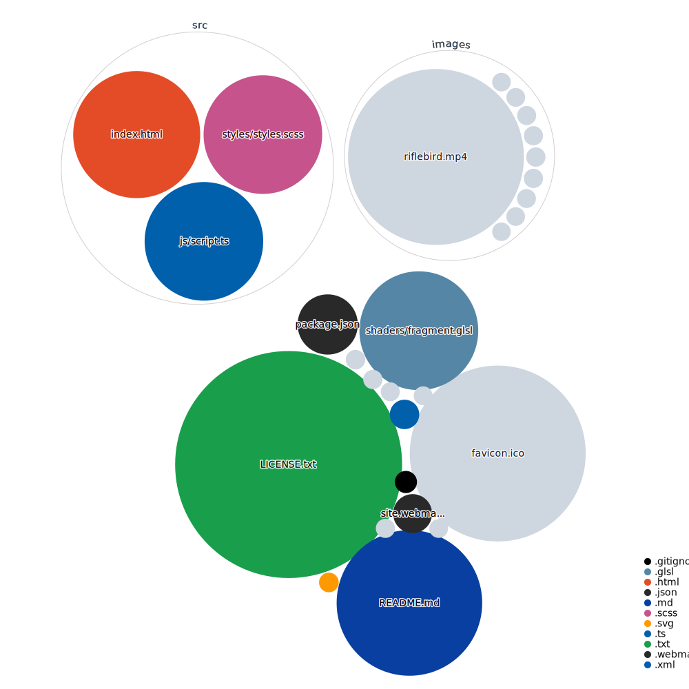

<a name="readme-top"></a>

<!-- PROJECT SHIELDS -->
[![Uptime][uptime-shield]][uptime-url]
[![Contributors][contributors-shield]][contributors-url]
[![Forks][forks-shield]][forks-url]
[![Stargazers][stars-shield]][stars-url]
[![Issues][issues-shield]][issues-url]
[![repo-size][repo-size-shield]][repo-size-url]
[![license][license-shield]][license-url]
<!-- for some reason those can't work yet [![w3c-validation][w3c-validation-shield]][w3c-validation-url]
[![OSSF-Scorecard Score][score-shield]][score-url] -->

<!-- PROJECT LOGO -->
<br />
<div align="center">
  

  <h3 align="center">365 things</h3>

  <p align="center">
    365 (rolling) things
    <br />
    <a href="https://github.com/hirako2000/365things/#about"><strong>Explore »</strong></a>
    <br />
    <br />
    <a href="https://365things.surge.sh">View Sketches</a>
    ::
    <a href="https://github.com/hirako2000/365things/issues">Report Bug</a>
    ::
    <a href="https://github.com/hirako2000/365things/issues">Request Feature</a>
  </p>
</div>


<!-- TABLE OF CONTENTS -->
<details>
  <summary>Table of Contents</summary>
  <ol>
    <li>
      <a href="#about">About</a>
      <ul>
        <li><a href="#built-with">Built With</a></li>
      </ul>
    </li>
    <li>
      <a href="#getting-started">Getting Started</a>
      <ul>
        <li><a href="#prerequisites">Prerequisites</a></li>
        <li><a href="#build">Build</a></li>
      </ul>
    </li>
    <li><a href="#asset-size-stats">Assets stats</a></li>
    <li><a href="#codebase">Codebase</a></li>
    <li><a href="#roadmap">Roadmap</a></li>
    <li><a href="#contributing">Contributing</a></li>
    <li><a href="#license">License</a></li>
    <li><a href="#acknowledgments">Acknowledgments</a></li>
  </ol>
</details>


<!-- ABOUT THE PROJECT -->
## About

[![Product Name Screen Shot][product-screenshot]](https://365things.surge.sh)

A challlenge project to push interesting content, every day, for 365 days.

<p align="right">(<a href="#readme-top">back to top</a>)</p>

### Built With

The site is rather simple
- Vanilla JS
- Parcel to bundle assets
- Gsap for some interactions
- SaSS for styling

More to come.

<!-- GETTING STARTED -->
## Getting Started

### Prerequisites

- git

Git clone/checkout this repo.

- nodejs/npm 


### Build

```
$ npm run build
```

It generates all asserts
  
#### Host / Deploy

Deploy as a static site 
There are free hosting services out there, e.g  [surge.sh](https://surge.sh), or [Netlify](https://www.netlify.com/).

<p align="right">(<a href="#readme-top">back to top</a>)</p>

### Customize 

??

## Asset size stats

| asset      | size    | gziped |
| ---------- | ------- | ------ |
| index.html | ?  | ? |
| styless | ? | ? |
| scripts  | ? | ? |
	
These don't media content

## Codebase



## Roadmap

- [x] layout
- [x] embed img
- [x] embed video
- [x] better layout
- [x] deploy POC
- [] make video pause and play uppon scrolling out/in 
- [] embed audio
- [] superb layout


## Contributing

Contributions are what make the open source community such an amazing place to learn, inspire, and create. Any contributions you make are **greatly appreciated**, although there isn't much to add to this project.

If you have a suggestion that would make this better, please fork the repo and create a pull request. You can also simply open an issue with the tag "enhancement".
Don't forget to give the project a star! Thanks again!

1. Fork the Project
2. Create your Feature Branch (`git checkout -b feature/some-feature`)
3. Commit your Changes (`git commit -m 'Add some feature'`)
4. Push to the Branch (`git push origin feature/some-feature`)
5. Open a Pull Request

## License

[![license][license-shield]][license-url]

This work is licensed under the [Creative Commons Attribution-NonCommercial-ShareAlike 4.0 International License][license-url].

[license-url]: http://creativecommons.org/licenses/by-nc-sa/4.0/
[cc-by-nc-sa-shield]: hhttps://img.shields.io/github/license/hirako2000/365things?style=for-the-badge

If you too produce work and publish it out there, it's clearer to choose a [license](https://choosealicense.com).

<p align="right">(<a href="#readme-top">back to top</a>)</p>

## Acknowledgments

Coming soon

## How It Works

Coming soon

[observatory-shield]: https://img.shields.io/mozilla-observatory/grade-score/365things.surge.sh?publish&style=for-the-badge
[uptime-shield]: https://img.shields.io/uptimerobot/ratio/m792462927-d88b9d2ebd47a1c7ccdf9763?style=for-the-badge
[uptime-url]: https://365things.surge.sh
[contributors-shield]: https://img.shields.io/github/contributors/hirako2000/365things.svg?style=for-the-badge
[contributors-url]: https://github.com/hirako2000/365things/graphs/contributors
[forks-shield]: https://img.shields.io/github/forks/hirako2000/365things.svg?style=for-the-badge
[forks-url]: https://github.com/hirako2000/365things/network/members
[stars-shield]: https://img.shields.io/github/stars/hirako2000/365things.svg?style=for-the-badge
[stars-url]: https://github.com/hirako2000/365things/stargazers
[issues-shield]: https://img.shields.io/github/issues/hirako2000/365things.svg?style=for-the-badge
[issues-url]: https://github.com/hirako2000/365things/issues
[license-shield]: https://img.shields.io/github/license/hirako2000/365things.svg?style=for-the-badge
[license-url]: https://github.com/hirako2000/365things/blob/main/LICENSE.txt
[w3c-validation-shield]: https://img.shields.io/w3c-validation/html?style=for-the-badge&targetUrl=https%3A%2F%2F365things.surge.sh
[w3c-validation-url]: https://jigsaw.w3.org/css-validator/validator?uri=https%3A%2F%2F365things.surge.sh&profile=css3svg&usermedium=all

[score-shield]: https://img.shields.io/ossf-scorecard/github.com/hirako2000/365things?style=for-the-badge
[score-url]: https://github.com/hirako2000/365things.surge.sh

[repo-size-shield]: https://img.shields.io/github/repo-size/hirako2000/365things?style=for-the-badge
[repo-size-url]: https://github.com/hirako2000/365things/archive/refs/heads/main.zip

[product-screenshot]: images/screenshot.png